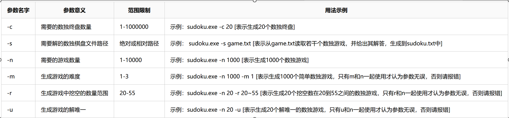

# Pair-programming
Pair programming assignment for software engineering course of Nankai University, topic: Sudoku

## 目标

实现一个能够生成数独游戏并求解数独问题的控制台程序，具体包括：

1. 生成不重复的数独终局至文件
2. 读取文件内的数独问题，求解并将结果输出至文件

## 任务要求

1. 采用C++语言实现
2. 可以使用.Net Framework
3. 运行环境为64-bit windows 10
4. 代码经过质量分析并消除警告
5. 写出至少10个测试用例来覆盖主要功能，统计覆盖率
6. 使用GitHub来管理源代码和测试样例，根据正常进度及时提交commit
7. 生成数独：shudu.exe -c 100

8. 求解数独：shudu.exe -s path_of_file

9. 空格用`$`表示

## 提交

1. 项目源代码（包含测试样例）的GitHub链接
2. 可执行文件
3. 简易用户手册、质量分析截图和测试覆盖率截图

## 代码质量分析

在`vs2019`中使用`cppcheck`进行代码质量分析，未找到相关问题，分析结果显示一些类成员`never used`，但实际上这些类成员都有用到，因此可忽略。除此以外，代码没有其他警告。

## 测试样例
以test.bat脚本形式给出。在该脚本中，多次传入参数，并调用sudoku.exe，检查程序对于传入参数的处理以及合法性检查是否完善，验证程序的健壮性。总共执行了20条命令，对每一个参数均进行了检查，并将结果写入在output.txt中。

## 覆盖率
在`vs2019`中使用`OpenCppCoverage`插件进行覆盖率的测试。主要测试了6种合法传参、4种非法传参下程序的代码覆盖率，具体的覆盖率情况在img/文件夹下给出，图片名称即为执行的命令。
